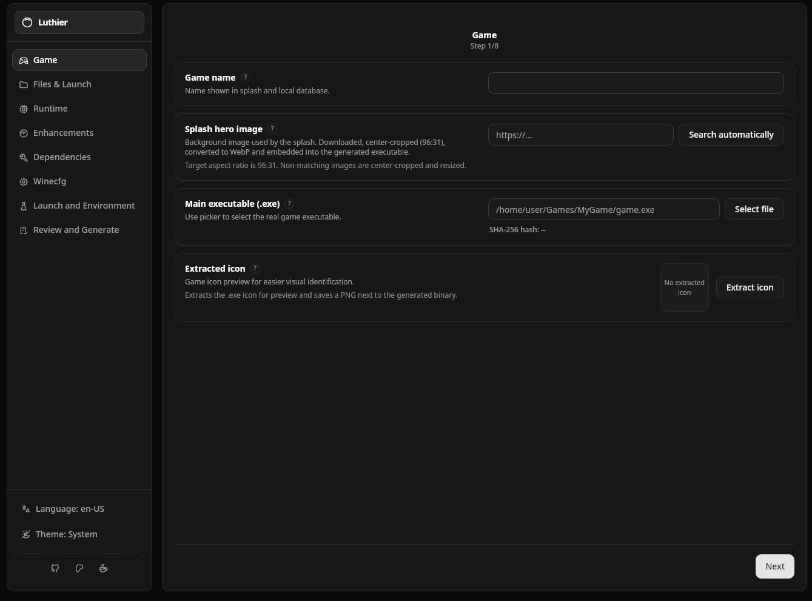
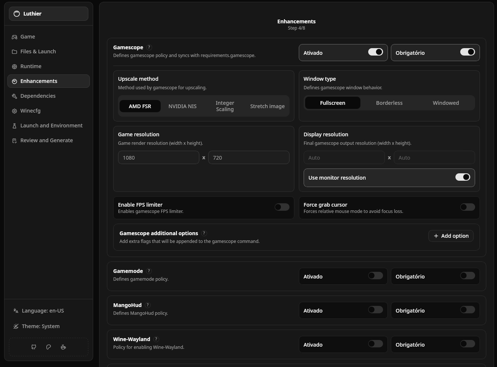
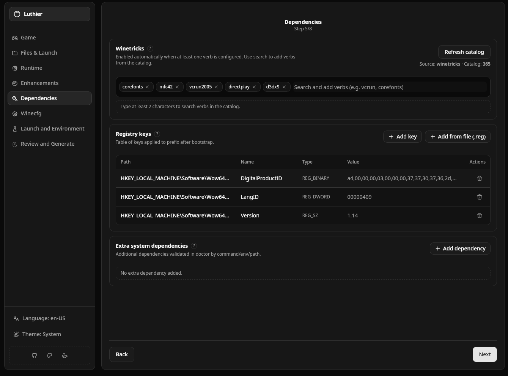

# Luthier

Luthier is a Linux desktop application that builds portable native launchers for Windows games.

For each game, Luthier generates a Linux executable next to the game `.exe`.  
That generated executable (internally, **Luthier Orchestrator**) carries an embedded payload with launch policy, runtime preferences, compatibility options, and setup rules.

## Product Overview

Luthier is designed to make Wine/Proton game packaging reproducible:

- Build once, run consistently across Linux hosts.
- Keep launcher behavior with the game folder.
- Validate host requirements before launch.
- Apply prefix/runtime/winecfg configuration automatically.
- Support optional performance wrappers such as Gamescope, MangoHud, and GameMode.

## Core Capabilities

- Native launcher generation with embedded payload.
- Runtime strategy: Proton, UMU, and Wine fallback policy.
- Prefix setup and dependency bootstrap.
- Registry import and winecfg application pipeline.
- Mount mappings from game-relative folders into Wine prefix paths.
- Structured doctor checks with categorized output.
- Splash-assisted launch mode and direct launch mode.
- Runtime/compatibility override flags (`--set-*`) for optional features.

## Supported Configuration Surface (Luthier UI)

Luthier currently covers the following tabs and domains:

### 1) Game
- Game name.
- Main Windows executable (`.exe`).
- Root folder and executable path validation.
- SHA-256 hash calculation.
- Hero image selection and icon extraction.

### 2) Files & Launch
- Launch arguments.
- Required game files (`integrity_files`).
- Root-relative validation for required artifacts.
- Mounted folders (`folder_mounts`) from game root to Windows target paths.

### 3) Runtime
- Runtime preference and version field.
- Runtime policy (`strict` vs fallback chain).
- ESYNC/FSYNC toggles.
- UMU required flow.
- EAC runtime policy.
- BattlEye runtime policy.

### 4) Enhancements
- Gamescope policy and options:
  - Resolution inputs.
  - Upscaling method (FSR/NIS/integer/stretch).
  - Window mode.
  - FPS limiter options.
  - Cursor grab and extra options.
- GameMode policy.
- MangoHud policy.
- Prime Offload policy.
- Wine-Wayland policy.
- HDR policy.
- DXVK-NVAPI policy.

### 5) Dependencies
- Winetricks policy and verb list.
- Extra system dependencies.
- Registry entries and `.reg` import workflow.
- Prefix-oriented dependency setup controls.

### 6) Winecfg
- DLL overrides.
- Windows version override.
- Graphics options:
  - Mouse capture.
  - Window decorations.
  - Window manager control.
  - Virtual desktop and resolution.
  - Screen DPI.
- Desktop integration options:
  - Desktop integration policy.
  - MIME associations policy.
  - Special folders mapping.
- Drive mappings.
- Audio backend selection (`pipewire`, `pulseaudio`, `alsa`, or default).

### 7) Launch & Environment
- Custom wrapper commands.
- Environment variables.
- Pre-launch and post-launch scripts.
- Validation and deduplication for path/command entries.

### 8) Review & Generate
- Consolidated summary of active configuration.
- Full JSON payload preview.
- Validation errors before generation.
- Test action and create executable action.

## Luthier Orchestrator CLI (Generated Game Executable)

The generated Orchestrator supports:

| Command | Purpose |
| --- | --- |
| `--help` | Print usage and examples. |
| `--doctor` | Run categorized requirement checks and print result. |
| `--show-payload` | Print embedded payload (hero base64 omitted). |
| `--show-base64-hero-image` | Print payload including splash hero base64. |
| `--save-payload` | Save embedded payload as `<executable-name>-payload.json` in game root. |
| `--set-mangohud on/off/default` | Override optional MangoHud state. |
| `--set-gamescope on/off/default` | Override optional Gamescope state. |
| `--set-gamemode on/off/default` | Override optional GameMode state. |
| `--set-umu on/off/default` | Override optional UMU state. |
| `--set-winetricks on/off/default` | Override optional Winetricks state. |
| `--set-steam-runtime on/off/default` | Override optional Steam Runtime state. |
| `--set-prime-offload on/off/default` | Override optional Prime Offload state. |
| `--set-wine-wayland on/off/default` | Override optional Wine-Wayland state. |
| `--set-hdr on/off/default` | Override optional HDR state. |
| `--set-auto-dxvk-nvapi on/off/default` | Override optional DXVK-NVAPI state. |
| `--set-easy-anti-cheat-runtime on/off/default` | Override optional EAC runtime state. |
| `--set-battleye-runtime on/off/default` | Override optional BattlEye runtime state. |
| `--play` | Run full launch pipeline without splash. |
| `--play-splash` | Run full launch pipeline with splash UI. |
| `--winecfg` | Run winecfg apply flow only. |
| `--lang <locale>` | Override splash/UI locale (for example `en-US`, `pt-BR`). |

### Execution Order When Commands Are Combined

When multiple flags are provided, execution is deterministic:

1. `--doctor`
2. payload output actions (`--show-payload`, `--show-base64-hero-image`, `--save-payload`)
3. override mutations (`--set-*`)
4. execution stage (`--play` or `--play-splash`, otherwise `--winecfg`)

### CLI Examples (using `game` as launcher name)

```bash
game --doctor
game --doctor --play
game --play
game --play-splash
game --set-mangohud on --set-gamescope off
game --set-mangohud off --play
game --show-payload
game --show-base64-hero-image
game --save-payload
```

## Orchestrator Play Flow

When you run `game --play`, the Orchestrator executes this pipeline before and during launch:

1. Load embedded payload from the generated executable.
2. Load saved runtime overrides for that game hash and apply them.
3. Acquire a per-game instance lock (prevents duplicate concurrent launch for the same game).
4. Resolve game root and main `.exe` path.
5. Validate required files (`integrity_files`) and block if something is missing.
6. Run `doctor` with policy enforcement (`MandatoryOn` can block, optional items can degrade).
7. Build and execute prefix setup plan (runtime-aware).
8. Apply registry entries (when configured).
9. Apply winecfg overrides (when configured).
10. Apply folder mounts into the prefix (`folder_mounts`).
11. Build final launch command (wrappers, runtime, env, cwd, args).
12. Execute `pre_launch` script (if configured).
13. Spawn game process and wait for completion.
14. Execute `post_launch` script (if configured).

For `game --play-splash`, the flow adds a pre-launch UI layer:

1. Show splash pre-launch screen with hero image and countdown.
2. Show optional toggles (only for configurable features) and persist override changes.
3. Show blocker screen when doctor reports missing mandatory requirements.
4. Start a child process with `--play` and stream structured progress messages in the splash.
5. Show post-game feedback screen when execution ends.

## Runtime Support Notes

Luthier is built for Linux hosts running Windows games through compatibility layers.

- Runtime candidates: UMU-based Proton, Proton (native), Wine.
- Environment detection uses PATH/env/system discovery.
- Doctor output respects policy state and reports actionable blockers/warnings.
- Optional feature overrides do not bypass mandatory policy constraints.

## Installation and Local Development

### Option A: Use a GitHub release

When releases are published, download from the repository Releases page and install on Linux.

### Option B: Build from source

Prerequisites:

- Linux host
- Rust toolchain (`cargo`, `rustc`)
- Node.js 20+
- npm
- Tauri system dependencies (WebKitGTK/GTK stack, distro specific)

Run desktop app in development:

```bash
cd apps/luthier
npm install
npm run tauri:dev
```

Build desktop artifacts:

```bash
cd apps/luthier
npm run tauri:bundle
```

## Typical User Workflow

1. Open the Luthier desktop app.
2. Pick game `.exe`.
3. Configure runtime, enhancements, dependencies, winecfg, wrappers, and environment.
4. Review summary.
5. Generate native launcher.
6. Distribute/run the generated launcher with the game folder.

## Adding a New Language

Luthier currently ships with `pt-BR` and `en-US`.

To add a new locale end-to-end:

1. Add base UI strings in `apps/luthier/src/i18n.ts`.
2. Add Luthier page strings in `apps/luthier/src/features/luthier/copy.<locale>.ts`.
3. Add validation strings in `apps/luthier/src/features/luthier/copy.validation.<locale>.ts`.
4. Register the locale merge in `apps/luthier/src/features/luthier/copy.ts`.
5. Add Orchestrator splash strings in `bins/luthier-orchestrator/src/splash/text.rs`.
6. Validate with `./scripts/check-quality.sh --full`.

Tip: use `en-US` as the reference source to keep key coverage consistent.

## Screenshots

### Game tab



### Enhancements tab



### Dependencies tab



## Repository Layout

```text
apps/luthier/                      # Desktop app (Tauri + SolidJS)
apps/luthier/src-tauri/            # Tauri backend
bins/luthier-orchestrator/         # Generated launcher runtime
bins/luthier-cli/                  # Local support CLI
bins/luthier-orchestrator-injector/
crates/luthier-core/
crates/luthier-orchestrator-core/
scripts/                           # Quality/security/architecture checks
.github/workflows/ci.yml           # CI pipeline
docs/planning/                     # Product planning and technical debt tracking
```

## Quality Gate

Run the full local gate before opening a PR:

```bash
./scripts/check-quality.sh --full
```

## Contributing

See [CONTRIBUTING.md](./CONTRIBUTING.md) for contribution flow and expectations.

## License

MIT. See [LICENSE](./LICENSE).
